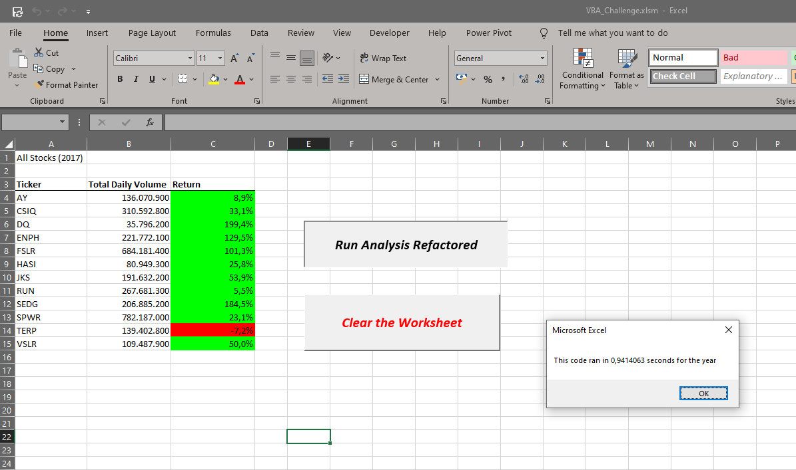
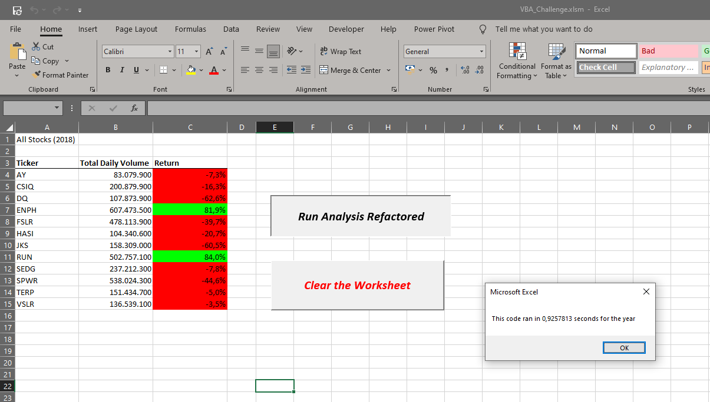

# Stock-Analysis
Stock-Analysis using VBA
# Overview of Project
This project regarding Module 2: VBA of Wall Street is developed on a VBA base related to the Bootcamp Data Analytics from the University of Toronto. The goal consists of analyzing and altering or refactoring the Stock Market Dataset with VBA arrangement code to circle through every one of the information one time to gather a whole dataset. All material regarding the findings and data analysis related to this project will be available on Gitbut for public view.

## Purpose
For this project, students from Data Analytics need to apply all concepts that we learned in class, including the fundamental building blocks of programming languages on VBA, such as creating a VBA macro, loops and conditionals, using nested for loops, colour formating, creating a button, refactor and apply syntax recollection, pattern recognition, problem decomposition and debugging. In order to figure out findings that support Steve's stock to run the data analysis. We will make the code easier to understand and modify, following the goals of refactoring, making the code more readable, fixing deficiencies that work faster and more correctly. 

# Results

We analyze 12 stocks from companies related to 2017 and 2018, considering annual return and total volume. The results below could help Steve with financial advice and an overview of results to help him make the better decision for future stock investments in Wall Street.

## All Stock (2017)

Regarding 12 stocks analyzed in 2017, only the ticker "TERP" showed a negative return of -7.2%. All other stocks had positive results. Some highlights were for stocks with positive results above 100% return, such as DQ, ENPH, FSLR and SEDG, which had 199.4%, 129.5%, 101.3% and 184.5%, respectively. The most significant return was for the DQ stock with 199.4%.

## All Stock (2018)

On the other hand, of the 12 stocks analyzed in 2018, only two tickers had a positive return, ENPH and RUN, with respectively 81.9% and 84%. All other stocks have negative results.

## All Stock (2017) vs (2018)

However, when we compare both results report to Total Dialy Volume between 2017 and 2018, we have two interesting results to consider. In terms of total daily volume, we have three stocks with positive results above 87%, even considering some of them with negative results between both years, such as DQ, ENPH and RUN. For example, The DQ Stock in 2017 had 35,796,200 in total daily volume and in 2018, the result was 107,873,900, representing an increase of 201.4% of total daily volume.

Regarding returns, the results in 2017 and 2018, we have two stocks with positive returns above 80%, such as ENPH and RUN.

Moreover, last but not least, based on both results in terms of the total daily volume and returns, we do have two stocks that performed with a positive result that was ENPH and RUN.

## Code Run time in second 2018 vs 2017

The code in VBA performed better for All Stock (2018); the code ran in just 0.9247813 seconds vs. 0.9414063 for 2017. Still, there is a slight difference in time to run the codes of just 0.016625 seconds.

## The advantages or disadvantages of refactoring code

The advantages of refactoring code is more organized structure and readable code; moreover, the code becomes easier to understand and modify, mainly helping beginner programmers learn VBA. Also, it becomes easier to identify errors and apply the debugging process.
Regarding the disadvantages, it can be related to the programmer's experience, as entry-level VBA programmers can take more time to finish the refactoring code or the debugging process.

## The pros and cons apply to refactoring the original VBA script

It helps in learning or practicing in VBA because codes already programmed and written again in the refactoring process are used; this helps to absorb knowledge better, run correct codes, and observe errors and corrections during the debugging process. The level of expertise for beginners in learning VBA can be challenging and even frustrating. It takes time and many hours of practice to improve technical knowledge in VBA to be applied in more extensive codes within refactoring.
